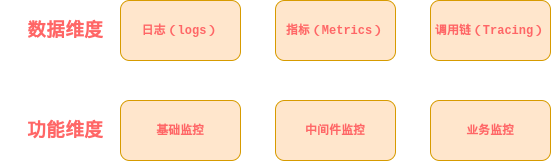
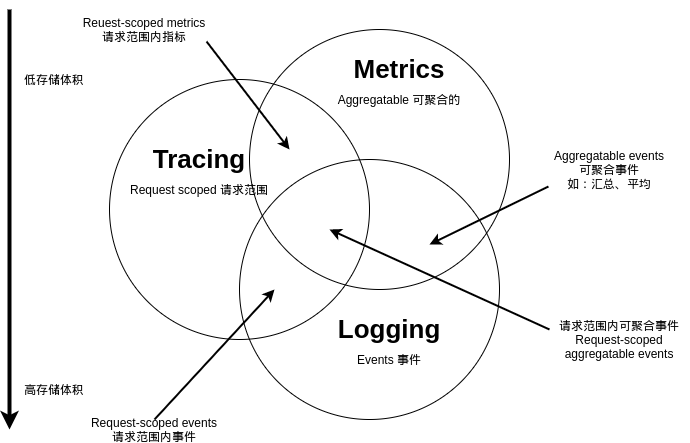
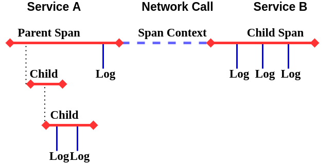

# 微服务架构体系下监控系统调研

---

## 背景

微服务架构是目前各大互联网公司普遍采用的软件架构方式。在微服务架构中，系统被拆分为多个小的、相互独立的服务，这些服务运行在自己的进程中，可以独立的开发和部署。在业务快速变化时，微服务单一职责、自治的特点，使系统的边界更加清晰，提升了系统的可维护性；同时，简化了系统部署的复杂度，可以针对某个微服务单独升级和发布；在业务增长时，也可以方便的进行独立扩展。

微服务架构虽然带来了很多好处，但也带来了新的问题。在以往的单体应用中，排查问题往往通过查看日志定位错误信息和异常堆栈；但是在微服务架构中服务繁多，出现问题时的问题定位变得非常困难。另外，微服务往往通过组合已有的服务来创建新服务，一个服务的故障很可能会产生雪崩效应，导致整个系统的不可用。因此，如何监控微服务的运行状况、当出现异常时能快速给出报警，这给开发人员带来很大挑战。

本文基于公司当前实际需求情况,对不同的监控系统进行调研。

## 监控系统概要

### 功能划分

应用机器的资源报警叫做监控；业务功能模块的日志报错信息叫做监控；一个APM的条件触发也叫监控。分布式系统错综复杂，做个统计指标的集合展示，也叫做监控;理清其中的关系，是我们建立合理的监控体系的前提。  

> __APM (Application Performance Management)__ 在信息技术和系统管理领域中，应用性能管理 (APM)是监测和管理性能及可用性的软件应用程序。

一般来说，我们习惯按照两种不同的维度进行监控系统的划分：

__数据维度__ 从数据类型划分，大体可以分为：

* __日志（logs)__  用于记录离散的事件信息。例如，应用程序的调试信息或错误信息。它是我们诊断问题的依据。比如我们说的ELK就是基于Logging。  

* __指标或度量（Metrics)__  基于时间序列的数据点，通过聚合和计算后能反应出一些重要指标的趋势。例如，队列的当前深度可被定义为一个度量值，在元素入队或出队时被更新；HTTP 请求个数可被定义为一个计数器，新请求到来时进行累。prometheus专注于Metrics领域。

* __调用链或追踪（Tracing）__ 调用链监控可以完整的呈现出一次请求的全部信息，包括服务调用链路、所耗时间等。如zipkin、skywalking等；

__功能维度__ 从业务功能维度划分，可以分为：基础监控、中间件监控、业务监控

* __基础监控__ 如健康检查等一类云平台（框架）等基础设施提供的能力，对于应用是否正常提供服务的监控；
* __中间件监控__ 对于不同的应用中间件是否正常运行的监控；
* __业务监控__ 对于不同的业务功能是否正常处理业务逻辑的监控；

一般现在的监控系统，都是按照数据维度划分进行设计的：

我们可以粗略的按照以上数据维度及划分标准，将现有的监控系统进行分类。例如，prometheus最初只是作为一个监控系统项目启动的，随着时间的推移，它可能会向跟踪方向发展，从而进入请求范围(request-scope)内的监控，但很可能不会深入到日志空间。ELK提供日志记录和汇总功能，使其成为可聚合的事件空间，但似乎在metrics和tracing领域不断积累更多的功能，意图将它推向中心

### 一般实现模块

不管什么样的监控系统，又涉及以下几个模块过程：

* __数据收集__ 如何在广度和效率上继续数据归并；
* __数据加工__ 数据的整理、传输和存储；
* __特征提取__ 大数据计算，中间结果生成存储；
* __数据展示__ 高颜值，多功能显示；

### 调研方向内容概述

后续调研，主要针对基于微服务架构体系下，对于应用的 Tracing 进行监控的不同方案展开。针对不同的实现方案，进行上述各实现模块的简单原理调研，分析总结各方案在三大功能指标方面的情况及优缺点。

### OpenTracing API 规范

提到对于应用Tracing的监控，就必须说一下 [OpenTracing](https://opentracing.io/) 规范。由于整个信息系统的快速发展，对于信息系统的不同监控实现、思路整体没有完整的规范体系，经常会有不同的监控系统实现 API 互不兼容，且很多对于应用系统存在很强的侵入性。开发人员对将其多语言系统与任何特定的分布式跟踪实现紧密耦合感到不安，但这些许多不同跟踪系统的应用程序级检测API具有非常相似的语义。基于此，衍生出了 OpenTracing 。

通过为流行的平台提供一致的，富有表现力的，供应商中立的API，OpenTracing使开发人员可以轻松地通过配置更改，添加（或切换）跟踪系统的实现。OpenTracing还为OSS检测和特定于平台的跟踪帮助程序库提供了通用语言。

#### 分布式追踪：一种思想模型

大多数分布式追踪系统的思想模型都来自 Google's Dapper 论文， OpenTracing 也使用相似的术语

Dapper的介绍可以看这个链接：
[Dapper，大规模分布式系统的跟踪系统 by bigbully](http://bigbully.github.io/Dapper-translation/)

* __Trace__ 事物在分布式系统中执行时的描述；
* __Spans__ 表示工作流的一部分带有命名的、时间范围的操作跨度信息。Spans接受key:value标签以及附加到特定Span实例的细粒度、带时间戳的结构化日志；
* __Span Contenxt__ 携带分布式事务的跟踪信息，包括当它通过网络或消息总线将服务传递给服务时。SPAN上下文包含Trace标识符、SPAN标识符和跟踪系统需要传播到下游服务的任何其他数据；

#### 现代软件系统四大件

从应用程序分层角度看分布式跟踪系统，现代软件系统如下图所示：

现代软件系统中的组件可以分为三类：

* 应用程序和业务逻辑：您的代码。
* 广泛共享的库：其他人的代码。
* 广泛共享的服务：其他人的基础架构。

这三个组件具有不同的要求，并驱动着负责监视应用程序的分布式跟踪系统的设计。最终的设计产生基于四个重要方面：

* 跟踪工具API：装饰应用程序代码的内容。
* [有线协议](https://en.wikipedia.org/wiki/Wire_protocol)：在RPC请求中与应用程序数据一起发送的内容。
* 数据协议：异步（[带外](https://baike.baidu.com/item/out-of-band/15801641?fr=aladdin)）发送到您的分析系统的内容。
* 分析系统：用于处理跟踪数据的数据库和交互式UI。

## 典型实现

1、Pinpoint  
github地址：[GitHub - naver/pinpoint: Pinpoint is an open source APM (Application Performance Management) tool for large-scale distributed systems written in Java](https://github.com/naver/pinpoint).  
对java领域的性能分析有兴趣的朋友都应该看看这个开源项目，这个是一个韩国团队开源出来的，通过JavaAgent的机制来做字节码代码植入，实现加入traceid和抓取性能数据的目的。NewRelic、Oneapm之类的工具在java平台上的性能分析也是类似的机制。  

2、SkyWalking  
github地址：[wu-sheng/sky-walking](https://github.com/wu-sheng/sky-walking)  
这是国内一位叫吴晟的工程师开源的，也是一个对JAVA分布式应用程序集群的业务运行情况进行追踪、告警和分析的系统，在github上也有16.9k关注了。功能已趋于完善，符合国人使用习惯。

3、Zipkin  
官网：[OpenZipkin · A distributed tracing system](https://link.zhihu.com/?target=http%3A//zipkin.io/)  
github地址：[GitHub - openzipkin/zipkin: Zipkin is a distributed tracing system](https://github.com/openzipkin/zipkin)  
这个是twitter开源出来的，也是参考Dapper的体系来做的。

Zipkin的java应用端是通过一个叫Brave的组件来实现对应用内部的性能分析数据采集。

Brave的github地址：[Brave-github](https://github.com/openzipkin/brave)  
这个组件通过实现一系列的java拦截器，来做到对http/servlet请求、数据库访问的调用过程跟踪。然后通过在spring之类的配置文件里加入这些拦截器，完成对java应用的性能数据采集。

4、CAT  
github地址：[GitHub - dianping/cat: Central Application Tracking](https://github.com/dianping/cat)  
这个是大众点评开源出来的，实现的功能也还是蛮丰富的，国内也有一些公司在用了。不过他实现跟踪的手段，是要在代码里硬编码写一些“埋点”，也就是侵入式的。这样做有利有弊，好处是可以在自己需要的地方加埋点，比较有针对性；坏处是必须改动现有系统，很多开发团队不愿意。

目前不是很活跃

### [Apache Skywalking](https://skywalking.apache.org/)
