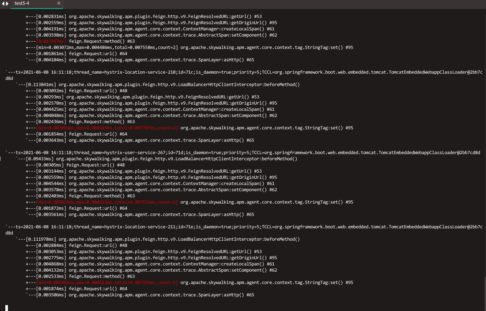
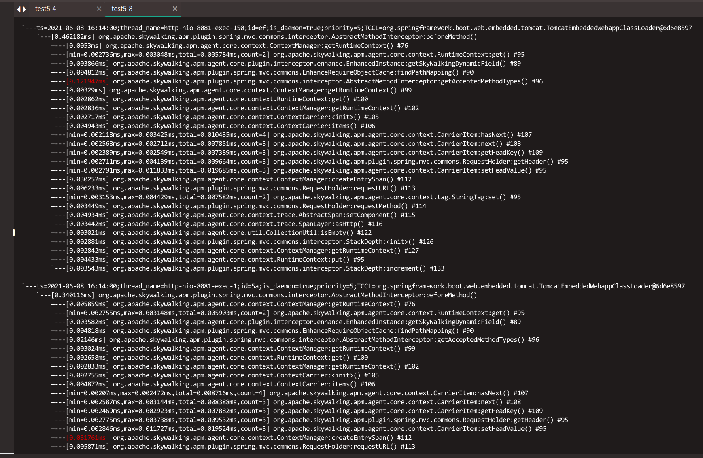

# Skywalking java 插件机制

[Java-Plugin-Development-Guide](https://github.com/apache/skywalking/blob/master/docs/en/guides/Java-Plugin-Development-Guide.m)

## 概念

### Span

Span 是分布式追踪系统中一个重要且常用的概念. 可从 [Google Dapper Paper](https://research.google.com/pubs/pub36356.html) 和 [OpenTracing](http://opentracing.io/) 学习更多与 Span 相关的知识.

SkyWalking 从 2017 年开始支持 OpenTracing 和 OpenTracing-Java API, 我们的 Span 在概念上与谷歌论文和 OpenTracing 里描述的类似. 我们也扩展了 Span.

Span 有三种类型

1.1 EntrySpan

EntrySpan 代表服务提供者, 也是服务器端的端点. 作为一个 APM 系统, 我们的目标是应用服务器. 所以几乎所有的服务和 MQ-消费者 都是 EntrySpan.

1.2 LocalSpan

LocalSpan 表示普通的 Java 方法, 它与远程服务无关, 不是 MQ 生产者/消费者, 也不是服务（例如 HTTP 服务）提供者/消费者.

1.3 ExitSpan

ExitSpan 代表一个服务客户端或 MQ 的生产者, 在 SkyWalking 的早期命名为 LeafSpan. 例如 通过 JDBC 访问 DB, 读取 Redis/Memcached 被归类为 ExitSpan.

### 上下文载体 (ContextCarrier)

为了实现分布式追踪, 需要绑定跨进程的追踪, 并且上下文应该在整个过程中随之传播. 这就是 ContextCarrier 的职责.

以下是有关如何在 A -> B 分布式调用中使用 ContextCarrier 的步骤.

1.在客户端, 创建一个新的空的 ContextCarrier.  
2.通过 ContextManager#createExitSpan 创建一个 ExitSpan 或者使用 ContextManager#inject 来初始化 ContextCarrier.  
3.将 ContextCarrier 所有信息放到请求头 (如 HTTP HEAD), 附件(如 Dubbo RPC 框架), 或者消息 (如 Kafka) 中  
4.通过服务调用, 将 ContextCarrier 传递到服务端.  
5.在服务端, 在对应组件的头部, 附件或消息中获取 ContextCarrier 所有内容.  
6.通过 ContextManager#createEntrySpan 创建 EntrySpan 或者使用 ContextManager#extract 来绑定服务端和客户端.  

让我们通过 Spring Cloud Feign 2.x plugin 插件和 Spring mvc-annotation-5.x 插件来演示，关键代码如下：

> 更详细的代码参考skywalking 对应插件源码

1.客户端　Spring Cloud Feign 2.x plugin 插件

``` java
...
        AbstractSpan span = ContextManager.createLocalSpan("Balancer" + operationName);
        span.setComponent(ComponentsDefine.FEIGN);
        Tags.HTTP.METHOD.set(span, request.method());
        Tags.URL.set(span, request.url());
        SpanLayer.asHttp(span);
...
```

2.服务端 Spring Mvc Annotation 5.x 插件

```
...
                ContextCarrier contextCarrier = new ContextCarrier();
                CarrierItem next = contextCarrier.items();
                while (next.hasNext()) {
                    next = next.next();
                    next.setHeadValue(request.getHeader(next.getHeadKey()));
                }

                AbstractSpan span = ContextManager.createEntrySpan(operationName, contextCarrier);
                Tags.URL.set(span, request.requestURL());
                Tags.HTTP.METHOD.set(span, request.requestMethod());
                span.setComponent(ComponentsDefine.SPRING_MVC_ANNOTATION);
                SpanLayer.asHttp(span);
...
```

### 上下文快照 (ContextSnapshot)

除了跨进程, 跨线程也是需要支持的, 例如异步线程（内存中的消息队列）和批处理在 Java 中很常见. 跨进程和跨线程十分相似, 因为都是需要传播上下文. 唯一的区别是, 跨线程不需要序列化.

以下是有关跨线程传播的三个步骤：

1.使用 ContextManager#capture 方法获取 ContextSnapshot 对象.  
2.让子线程以任何方式, 通过方法参数或由现有参数携带来访问 ContextSnapshot  
3.在子线程中使用 ContextManager#continued.  

### 核心 API

#### 上下文管理器 (ContextManager)

ContextManager 提供所有主要 API.

1.创建 EntrySpan

```java
public static AbstractSpan createEntrySpan(String endpointName, ContextCarrier carrier)
```

根据操作名称(例如服务名称, uri) 和 上下文载体 (ContextCarrier) 创建 EntrySpan.

2.创建 LocalSpan

```java
public static AbstractSpan createLocalSpan(String endpointName)
```

根据操作名称(例如完整的方法签名)创建 (e.g. full method signature)

3.创建 ExitSpan

```java
public static AbstractSpan createExitSpan(String endpointName, ContextCarrier carrier, String remotePeer)
```

根据操作名称(例如服务名称, uri), 上下文载体 (ContextCarrier) 以及对等端 (peer) 地址 (例如 ip + port 或 hostname + port) 创建 ExitSpan.

### AbstractSpan

```java
    /**
     * Set the component id, which defines in {@link ComponentsDefine}
     *
     * @param component
     * @return the span for chaining.
     */
    AbstractSpan setComponent(Component component);

    AbstractSpan setLayer(SpanLayer layer);

    /**
     * Set a key:value tag on the Span.
     *
     * @return this Span instance, for chaining
     */
    AbstractSpan tag(String key, String value);

    /**
     * Record an exception event of the current walltime timestamp.
     *
     * @param t any subclass of {@link Throwable}, which occurs in this span.
     * @return the Span, for chaining
     */
    AbstractSpan log(Throwable t);

    AbstractSpan errorOccurred();

    /**
     * Record an event at a specific timestamp.
     *
     * @param timestamp The explicit timestamp for the log record.
     * @param event the events
     * @return the Span, for chaining
     */
    AbstractSpan log(long timestamp, Map<String, ?> event);

    /**
     * Sets the string name for the logical operation this span represents.
     *
     * @return this Span instance, for chaining
     */
    AbstractSpan setOperationName(String endpointName);
```

除了设置操作名称, 标签信息和日志外, 还要设置两个属性, 即 component（组件）和 layer（层）, 特别是对于 EntrySpan 和 ExitSpan.

SpanLayer 是 span 的类别. 有五个值:

1.UNKNOWN (默认值)  
2.DB  
3.RPC_FRAMEWORK,（针对 RPC 框架, 非普通的 HTTP 调用）  
4.HTTP  
5.MQ  

组件 ID 由 SkyWalking 项目定义和保留, 对于组件的名称或 ID 的扩展, 请遵循[组件库的定义与扩展](https://skyapm.github.io/document-cn-translation-of-skywalking/zh/8.0.0/guides/Component-library-settings.html).

### 高级 API

#### 异步 Span API

关于 Span 有一系列高级 API, 他们都是在异步场景下使用的. 当 Span 的 tag, 日志和属性(包括结束时间)需要在另一个线程中设置时, 你就应该使用这些 API.

```java
    /**
     * The span finish at current tracing context, but the current span is still alive, until {@link #asyncFinish}
     * called.
     *
     * This method must be called<br/>
     * 1. In original thread(tracing context).
     * 2. Current span is active span.
     *
     * During alive, tags, logs and attributes of the span could be changed, in any thread.
     *
     * The execution times of {@link #prepareForAsync} and {@link #asyncFinish()} must match.
     *
     * @return the current span
     */
    AbstractSpan prepareForAsync();

    /**
     * Notify the span, it could be finished.
     *
     * The execution times of {@link #prepareForAsync} and {@link #asyncFinish()} must match.
     *
     * @return the current span
     */
    AbstractSpan asyncFinish();
```

1.在原始上下文中调用 #prepareForAsync.  
2.当前线程中的作业完成后，在原始上下文中运行 ContextManager#stopSpan。
3.将该 Span 传播到其他线程.  
4.在全部操作就绪之后, 可在任意线程中调用 #asyncFinish 结束调用.  
5.当所有 Span 的 #prepareForAsync 完成后, 追踪上下文会结束, 并一起被回传到后端服务(根据 API 执行次数判断).  

### 开发插件

#### 摘要

追踪的基本方法是拦截 Java 方法, 使用字节码操作技术和 AOP 概念. SkyWalking 包装了字节码操作技术, 并追踪上下文的传播. 所以你只需要定义拦截点(换句话说就是 Spring 的切面).

#### 拦截

SkyWalking 提供两类通用的定义去拦截构造方法, 实例方法和类方法.

* __ClassInstanceMethodsEnhancePluginDefine__ 定义了构造方法 __Contructor__ 拦截点和 __instance method__ 实例方法拦截点.
* __ClassStaticMethodsEnhancePluginDefine__ 定义了类方法 __class method__ 拦截点.
当然, 您也可以继承 __ClassEnhancePluginDefine__ 去设置所有的拦截点, 但这不常用.

#### 实现插件

此部分可参考[官方文档](https://github.com/apache/skywalking/blob/master/docs/en/guides/Java-Plugin-Development-Guide.md#develop-a-plugin)，有更详细的说明

### 典型调用插件演示

如我们服务常见的一种调取场景为例，仓库服务有如下代码：

```java


    /**
     * 转换区域(省市区)
     *
     * @param ids
     *            省市区id
     * @return
     */
    public Map<Long, String> transformRegion(Set<Long> ids) {
        if (ids == null || ids.isEmpty()) {
            return null;
        }
        List<RegionNameDTO> regionNameList = regionServiceApiClient.findRegionNameListByIds(ids);
        if (regionNameList == null || regionNameList.isEmpty()) {
            return null;
        }
        return regionNameList.stream().collect(Collectors.toMap(RegionNameDTO::getId, RegionNameDTO::getName));

    }

```

利用　arthas 工具分别对仓库服务的org.apache.skywalking.apm.plugin.feign.http.v9.LoadBalancerHttpClientInterceptor#beforeMethod
和地址服务的org.apache.skywalking.apm.plugin.spring.mvc.commons.interceptor.AbstractMethodInterceptor#beforeMethod
方法进行trace 验证，情况如下：




以上就是我们当前服务实现方案下一种典型feign调用，skywalking 进行服务trace span 信息收集的过程，当然一个完整的 trace 可能包含的部分更多部分，如 jdbc 调取、消息队列、redis 、es 等等。无论何种 trace span 信息的获取，java体系下都是通过进行AOP切面做类增强，以插件形式实现的信息收集。

### 服务评分

skywalking 在采集到的trace及metrics信息基础上,通过使用oal进行一系列指标的统计，其中默认提供SLA及Apdex两个评分标准来供我们判断服务整体的运行情况：

> OAL [Observability Analysis Language (可观察性分析语言)](https://github.com/apache/skywalking/blob/master/docs/en/concepts-and-designs/oal.md)  

__SLA__:一般指服务级别协议。服务级别协议是指提供服务的企业与客户之间就服务的品质、水准、性能等方面所达成的双方共同认可的协议或契约。  

__APDEX__:应用性能指数.用一句话来概括，Apdex是用户对应用性能满意度的量化值。  

它提供了一个统一的测量和报告用户体验的方法，第一次把最终用户的体验和应用性能联系在了一起。基于“响应性”，Apdex定义了3个用户满意度区间:  
满意: 这样的响应时间让用户感到很愉快，例如少于3秒钟。  
容忍: 慢了一点，但还可以接受，继续这一应用过程，例如3～12秒。  
失望: 太慢了，受不了了，用户决定放弃这个应用，例如超过12秒。  

“满意”、“容忍”、“失望”这三个区间通过响应时间数值“T”来划分，T值代表着用户对应用性能满意的响应时间界限或者说是“门槛”（Threshold），也就是第一个区间“满意”的底线，如3秒，满意区间就是03秒；响应时间超过T值用户就有些不满了，下一个区间“容忍”的界限值则是T和4T，即3至12秒之间为容忍区间；响应时间再长用户就开始考虑放弃了，最后一个区间“失望”的响应时间则大于4T，即多于12秒。  

之后，Apdex对应用中发生的任务进行采样，并且按其响应时间把采样划分到相应的满意度区间，计数，再用一个公式计算Apdex指数：
实际上，这个公式的意义在于：  
一个满意样本得分为：1  
一个容忍样本得分为：0.5  
一个失望样本得分为：0  
因此公式也可以写成：  

> Apdex指数 ＝（1 × 满意样本 ＋ 0.5 × 容忍样本）÷ 样本总数  

这样，采样结果被量化为一个0到1之间的数值即“Apdex指数”，0代表没有满意用户，1则代表所有用户都满意。经过统计，Apdex把这个数值与用户满意程度细化对应.

#### SLA计算实现

skywalking 进行SLA计算的oal分析语句如下：

```oal
endpoint_sla = from(Endpoint.*).percent(status == true);
```

可以看出skywalking sla　的定义为范围内采样信息状态成功所占有的比例，而针对Feign调用采样插件有如下代码逻辑:

```java
    /**
     * Get the status code from {@link Response}, when status code greater than 400, it means there was some errors in
     * the server. Finish the {@link AbstractSpan}.
     *
     * @param method intercept method
     * @param ret    the method's original return value.
     * @return origin ret
     */
    @Override
    public Object afterMethod(EnhancedInstance objInst, Method method, Object[] allArguments, Class<?>[] argumentsTypes,
                              Object ret) {
        Response response = (Response) ret;
        if (response != null) {
            int statusCode = response.status();

            AbstractSpan span = ContextManager.activeSpan();
            if (statusCode >= 400) {
                span.errorOccurred();
                Tags.STATUS_CODE.set(span, Integer.toString(statusCode));
            }
        }

        ContextManager.stopSpan();

        return ret;
    }


```

在进行feign 调用时，如果服务端响应 http　状态码大于等于400,则skywalking 默认 feign 插件认为该服务调取为失败情况，这样会导致进行服务sla评分计算时评分降低.

而我们当前服务实现中，业务异常也是通过抛出LeadingServiceException 异常进行传递，且统一将改异常封装httpCode 状态码为 500.这样就会产生我们以skywalking 提供的评分标准判断服务　SLA　的话，评分均偏低的情况

```java

    @ExceptionHandler(LeadingServiceException.class)
    @ResponseStatus(value = HttpStatus.INTERNAL_SERVER_ERROR)
    public ResponseEntity<Object> handleLeadingServiceException(LeadingServiceException ex,
        HttpServletRequest request) {
        log.error("handleLeadingServiceException:", ex);
        return new ResponseEntity<>(ResponseData.badRequest(ex.getErrorCode(), ex.getErrorMessage()),
            HttpStatus.BAD_REQUEST);
    }
```
