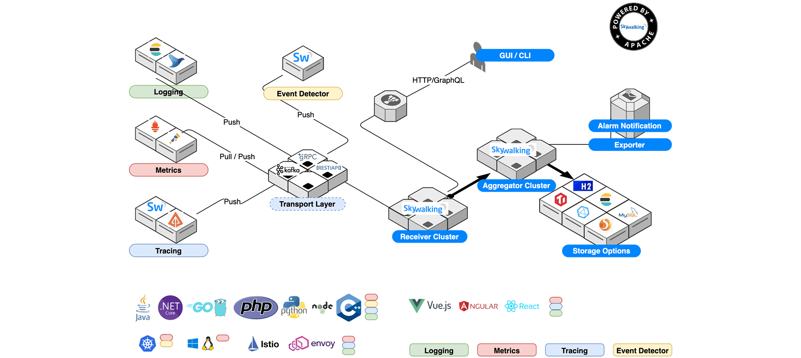
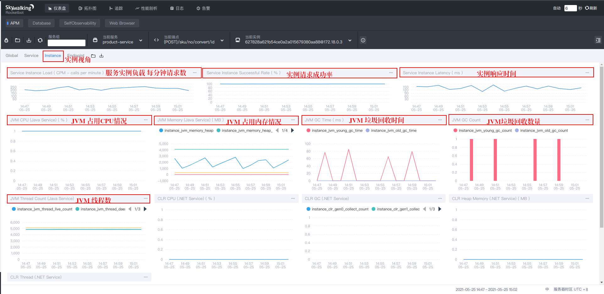
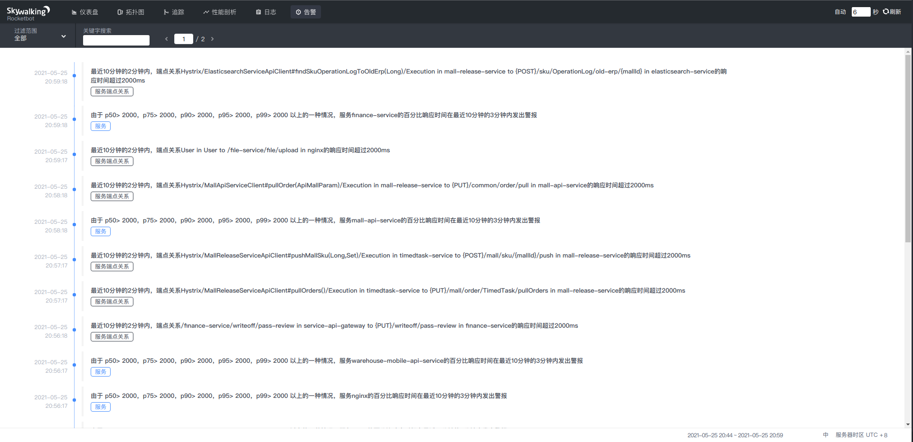

# Skywalking 服务链路追踪

---

## Skywalking 简介

> SkyWalking是一个开源的观测平台，用于从服务和云原生等基础设施中收集、分析、聚合以及可视化数据。SkyWalking 提供了一种简便的方式来清晰地观测分布式系统，甚至可以观测横跨不同云的系统。SkyWalking 更像是一种现代的应用程序性能监控（Application Performance Monitoring，即APM）工具，专为云原生，基于容器以及分布式系统而设计

项目地址： [Skywalking](https://github.com/apache/skywalking)  

SkyWalking是一个开源APM系统，包括对Cloud Native体系结构中的分布式系统的监视，跟踪，诊断功能。  

核心功能如下:

* 服务，服务实例，端点指标分析
* 根本原因分析。在运行时分析代码
* 服务拓扑图分析
* 服务，服务实例和端点依赖关系分析
* 检测到慢速服务和端点
* 性能优化
* 分布式跟踪和上下文传播
* 数据库访问指标。检测慢速数据库访问语句（包括SQL语句）
* 警报
* 浏览器性能监控
* 基础架构（VM，网络，磁盘等）监控
* 跨指标，跟踪和日志的协作

SkyWalking 在逻辑上分为四部分：探针、平台后端、存储和用户界面。其架构图如下：



* 探针：基于不同的来源探针可能是不一样的，但作用都是收集数据，将数据格式化为 SkyWalking 适用的格式。例如在Java中则是做字节码植入，无侵入式的收集，并通过 HTTP 或者 gRPC 或者 消息 等方式发送数据到平台后端

* 平台后端：是一个支持集群模式运行的后台，用于数据聚合、数据分析以及驱动数据流从探针到用户界面的流程。平台后端还提供了各种可插拔的能力，如不同来源数据（如来自 Zipkin）格式化，不同存储系统以及集群管理。你甚至还可以使用观测分析语言来进行自定义聚合分析。

* 存储：是开放式的，可以选择一个既有的存储系统，如 ElasticSearch、H2 或 MySQL 集群（Sharding-Sphere 管理）等，也可以选择自己实现一个存储系统。

* 用户界面：也就是SkyWalking的可视化界面，UI非常炫酷且强大，同样它也是可定制以匹配你已存在的后端的

SkyWalking 为观察和监控分布式系统提供了许多不同场景下的解决方案。例如为Java、C#及Node.js提供语言自动探针，无侵入式的收集。同时也为一些编译型语言C++、GO等提供了手动打点 SDK。除此之外，还可以使用服务网格基础探针来收集数据，以帮助了解整个分布式系统。

* Java，.NET Core，NodeJS，PHP和Python 语言自动探针。
* Go和C ++ SDK。
* LUA代理，尤其适用于Nginx，OpenResty和Apache APISIX。
* 浏览器代理。
* 服务网格化观察、控制面板和数据面板。
* 度量系统接入，包括Prometheus，OpenTelemetry，Spring Sleuth（Micrometer），Zabbix。
* 日志。
* Zipkin v1 / v2跟踪。（无分析）

在SkyWalking中也存在服务、服务实例及端点概念，因为SkyWalking就是提供了这些概念的观测能力：

服务（Service）：表示对请求提供相同行为的一系列或一组工作负载。在使用打点代理或 SDK 的时候，你可以定义服务的名字。如果不定义的话，SkyWalking 将会使用你在平台上定义的名字，如 Istio。

服务实例（Service Instance）：上述的一组工作负载中的每一个工作负载称为一个实例。就像 Kubernetes 中的 pods 一样，服务实例未必就是操作系统上的一个进程。但当你在使用打点代理的时候， 一个服务实例实际就是操作系统上的一个真实进程。

端点（Endpoint）：对于特定服务所接收的请求路径，如 HTTP 的 URI 路径和 gRPC 服务的类名 + 方法签名

__Skywalking 主要优势__：

多种监控手段，语言探针和服务网格（Service Mesh）  
模块化，UI、存储、集群管理多种机制可选  
支持告警  
优秀的可视化方案  
社区活跃

## 搭建Skywalking 

### OAP & UI  

docker swarm 脚本如下：

``` yml

# Licensed to the Apache Software Foundation (ASF) under one
# or more contributor license agreements.  See the NOTICE file
# distributed with this work for additional information
# regarding copyright ownership.  The ASF licenses this file
# to you under the Apache License, Version 2.0 (the
# "License"); you may not use this file except in compliance
# with the License.  You may obtain a copy of the License at
#
#     http://www.apache.org/licenses/LICENSE-2.0
#
# Unless required by applicable law or agreed to in writing, software
# distributed under the License is distributed on an "AS IS" BASIS,
# WITHOUT WARRANTIES OR CONDITIONS OF ANY KIND, either express or implied.
# See the License for the specific language governing permissions and
# limitations under the License.

# source from https://github.com/apache/skywalking-docker/blob/master/8/8.5.0/compose-es7/docker-compose.yml
# by tecyang
# 2020-11-10

version: "3.4"
services:
  oap1:
    image: harbor.66123123.com/library/skywalking-oap-server:8.5.0-es7
    deploy:
      resources:
        limits:
          memory: 2g
      placement:
        constraints:
          - node.labels.role == web
      mode: replicated
      replicas: 1
      restart_policy:
        condition: on-failure
        delay: 10s
        max_attempts: 3
        window: 120s
    # healthcheck:
    #   test: ["CMD-SHELL", "/skywalking/bin/swctl ch"]
    #   interval: 30s
    #   timeout: 10s
    #   retries: 3
    #   start_period: 40s
    restart: always
    # ports:
    #   - 11800:11800
    #   - 12800:12800
    environment:
      SW_STORAGE: elasticsearch7
      SW_STORAGE_ES_CLUSTER_NODES: es01:9200,es02:9200,es03:9200
      SW_ES_USER: elastic
      SW_ES_PASSWORD: leading20200810
      SW_STORAGE_ES_INDEX_SHARDS_NUMBER: 2
      SW_STORAGE_ES_INDEX_REPLICAS_NUMBER: 0
      SW_CLUSTER: zookeeper
      SW_CLUSTER_ZK_HOST_PORT: zookeeper1:8010,zookeeper2:8010,zookeeper3:8010
      # 修改grpc 配置
      SW_CORE_GRPC_POOL_QUEUE_SIZE: 40000
      SW_CORE_GRPC_THREAD_POOL_SIZE: 64
      # 自监控
      SW_PROMETHEUS_FETCHER_ACTIVE: 'true'
      SW_TELEMETRY: prometheus
      # 每2000个请求执行一次批量
      SW_STORAGE_ES_BULK_ACTIONS: 4000
      # 每 20mb 刷新一次内存块
      SW_STORAGE_ES_BULK_SIZE: 40
      # 无论请求的数量如何，每10秒刷新一次堆
      SW_STORAGE_ES_FLUSH_INTERVAL: 30
      # 并发请求的数量
      SW_STORAGE_ES_CONCURRENT_REQUESTS: 4
      # elasticsearch 查询的最大数量
      SW_STORAGE_ES_QUERY_MAX_SIZE: 8000
      # elasticsearch 查询段最大数量
      # SW_STORAGE_ES_QUERY_SEGMENT_SIZE: 200
      # 采样率 50%
      SW_TRACE_SAMPLE_RATE: 5000
      JAVA_OPTS: " -Xmx1g -Xms1g "
    volumes:
      - /etc/localtime:/etc/localtime
      - /etc/timezone:/etc/timezone
      - ./config/alarm-settings.yml:/skywalking/config/alarm-settings.yml
    networks:
      swarm_net:
        aliases:
          - oap1
  oap2:
    image:  harbor.66123123.com/library/skywalking-oap-server:8.5.0-es7
    deploy:
      resources:
        limits:
          memory: 2g
      placement:
        constraints:
          - node.labels.role == web
      mode: replicated
      replicas: 1
      restart_policy:
        condition: on-failure
        delay: 10s
        max_attempts: 3
        window: 120s
    # healthcheck:
    #   test: ["CMD-SHELL", "/skywalking/bin/swctl ch"]
    #   interval: 30s
    #   timeout: 10s
    #   retries: 3
    #   start_period: 40s
    restart: always
    # ports:
    #   - 11800:11800
    #   - 12800:12800
    environment:
      SW_STORAGE: elasticsearch7
      SW_STORAGE_ES_CLUSTER_NODES: es01:9200,es02:9200,es03:9200
      SW_ES_USER: elastic
      SW_ES_PASSWORD: leading20200810
      SW_STORAGE_ES_INDEX_SHARDS_NUMBER: 2
      SW_STORAGE_ES_INDEX_REPLICAS_NUMBER: 0
      SW_CLUSTER: zookeeper
      SW_CLUSTER_ZK_HOST_PORT: zookeeper1:8010,zookeeper2:8010,zookeeper3:8010
      # 修改grpc 配置
      SW_CORE_GRPC_POOL_QUEUE_SIZE: 40000
      SW_CORE_GRPC_THREAD_POOL_SIZE: 64
      # 自监控
      SW_PROMETHEUS_FETCHER_ACTIVE: 'true'
      SW_TELEMETRY: prometheus
      # 每2000个请求执行一次批量
      SW_STORAGE_ES_BULK_ACTIONS: 4000
      # 每 20mb 刷新一次内存块
      SW_STORAGE_ES_BULK_SIZE: 40
      # 无论请求的数量如何，每10秒刷新一次堆
      SW_STORAGE_ES_FLUSH_INTERVAL: 30
      # 并发请求的数量
      SW_STORAGE_ES_CONCURRENT_REQUESTS: 4
      # elasticsearch 查询的最大数量
      SW_STORAGE_ES_QUERY_MAX_SIZE: 8000
      # elasticsearch 查询段最大数量
      # SW_STORAGE_ES_QUERY_SEGMENT_SIZE: 200
      # 采样率 50%
      SW_TRACE_SAMPLE_RATE: 5000
      JAVA_OPTS: " -Xmx1g -Xms1g "
    volumes:
      - /etc/localtime:/etc/localtime
      - /etc/timezone:/etc/timezone
      - ./config/alarm-settings.yml:/skywalking/config/alarm-settings.yml
    networks:
      swarm_net:
        aliases:
          - oap2
  oap3:
    image:  harbor.66123123.com/library/skywalking-oap-server:8.5.0-es7
    deploy:
      resources:
        limits:
          memory: 2g
      placement:
        constraints:
          - node.labels.role == web
      mode: replicated
      replicas: 1
      restart_policy:
        condition: on-failure
        delay: 10s
        max_attempts: 3
        window: 120s
    restart: always
    # healthcheck:
    #   test: ["CMD-SHELL", "/skywalking/bin/swctl ch"]
    #   interval: 30s
    #   timeout: 10s
    #   retries: 3
    #   start_period: 40s
    # ports:
    #   - 11800:11800
    #   - 12800:12800
    environment:
      SW_STORAGE: elasticsearch7
      SW_STORAGE_ES_CLUSTER_NODES: es01:9200,es02:9200,es03:9200
      SW_ES_USER: elastic
      SW_ES_PASSWORD: leading20200810
      SW_STORAGE_ES_INDEX_SHARDS_NUMBER: 2
      SW_STORAGE_ES_INDEX_REPLICAS_NUMBER: 0
      SW_CLUSTER: zookeeper
      SW_CLUSTER_ZK_HOST_PORT: zookeeper1:8010,zookeeper2:8010,zookeeper3:8010
      # 修改grpc 配置
      SW_CORE_GRPC_POOL_QUEUE_SIZE: 40000
      SW_CORE_GRPC_THREAD_POOL_SIZE: 64
      # 自监控
      SW_PROMETHEUS_FETCHER_ACTIVE: 'true'
      SW_TELEMETRY: prometheus
      # 每2000个请求执行一次批量
      SW_STORAGE_ES_BULK_ACTIONS: 4000
      # 每 20mb 刷新一次内存块
      SW_STORAGE_ES_BULK_SIZE: 40
      # 无论请求的数量如何，每10秒刷新一次堆
      SW_STORAGE_ES_FLUSH_INTERVAL: 30
      # 并发请求的数量
      SW_STORAGE_ES_CONCURRENT_REQUESTS: 4
      # elasticsearch 查询的最大数量
      SW_STORAGE_ES_QUERY_MAX_SIZE: 8000
      # elasticsearch 查询段最大数量
      # SW_STORAGE_ES_QUERY_SEGMENT_SIZE: 200
      # 采样率 50%
      SW_TRACE_SAMPLE_RATE: 5000
      JAVA_OPTS: " -Xmx1g -Xms1g "
    volumes:
      - /etc/localtime:/etc/localtime
      - /etc/timezone:/etc/timezone
      - ./config/alarm-settings.yml:/skywalking/config/alarm-settings.yml
    networks:
      swarm_net:
        aliases:
          - oap3
  ui:
    image:  harbor.66123123.com/library/skywalking-ui:8.5.0
    deploy:
      resources:
        limits:
          memory: 2g
      mode: replicated
      replicas: 1
      # placement:
      #   constraints:
      #     - node.hostname == pp1
      restart_policy:
        condition: on-failure
        delay: 10s
        max_attempts: 3
        window: 120s
    container_name: ui
    depends_on:
      - oap1
      - oap2
      - oap3
    links:
      - oap1
      - oap2
      - oap3
    restart: always
    ports:
      - 12345:8080
    environment:
      SW_OAP_ADDRESS: oap1:12800,oap2:12800,oap3:12800
    volumes:
      - /etc/localtime:/etc/localtime
      - /etc/timezone:/etc/timezone
    networks:
      swarm_net:
        aliases:
          - ui

networks:
  swarm_net:
    external:
      name: swarm_net

```

### java agent 

``` initSkywalking.sh

#!/bin/bash

wget -c https://mirrors.bfsu.edu.cn/apache/skywalking/8.5.0/apache-skywalking-apm-es7-8.5.0.tar.gz
mkdir apm-es7-8.5.0
tar -zxvf apache-skywalking-apm-es7-8.5.0.tar.gz -C ./apm-es7-8.5.0

cp -rf ./apm-es7-8.5.0/apache-skywalking-apm-bin-es7/* /home/produce/nas/skywalking/
# 对应服务启动配置agent挂载目录

```

## Skywalking 功能介绍

Skywalking 收集了大量信息，基于默认提供UI进行功能介绍，主要分为如下几部分：

* 仪表盘
* 拓扑图
* 服务链路追踪功能
* 性能剖析
* 日志
* 告警

### 仪表盘


<!--  -->




### 拓扑图


### 服务链路追踪功能


### 性能剖析


### 日志


### 告警



## skywalking 告警规则

### 告警模块基本原理

Skywalking 发送告警的基本原理是每隔一段时间轮询 skywalking-oap 收集到的链路追踪的数据，再根据所配置的告警规则（如服务响应时间、服务响应时间百分比）等，如果达到阈值则发送响应的告警信息。 发送告警信息是以线程池异步的方式调用 webhook 接口完成，（具体的webhook接口可以使用者自行定义），从而开发者可以在指定的webhook接口中自行编写各种告警方式，钉钉告警、邮件告警等等。告警的信息也可以在RocketBot即ui中查看到。

目前对应 8.5.0 版本支持的告警接口如下：

* 普通webhook
* gRPCHook
* Slack Chat Hook
* WeChat Hook（微信告警）
* Dingtalk Hook（钉钉告警）
* Feishu Hook（飞书告警）

### 默认告警规则

告警的核心由一组规则驱动，这些规则定义在 安装解压缩包里面的config/alarm-settings.yml文件中, 打开之后如下所示：  
rules 即为需要配置的告警规则的列表；规则名不能重复且必须以 '_rule' 为结尾.

``` yml

# Licensed to the Apache Software Foundation (ASF) under one
# or more contributor license agreements.  See the NOTICE file
# distributed with this work for additional information
# regarding copyright ownership.  The ASF licenses this file
# to you under the Apache License, Version 2.0 (the
# "License"); you may not use this file except in compliance
# with the License.  You may obtain a copy of the License at
#
#     http://www.apache.org/licenses/LICENSE-2.0
#
# Unless required by applicable law or agreed to in writing, software
# distributed under the License is distributed on an "AS IS" BASIS,
# WITHOUT WARRANTIES OR CONDITIONS OF ANY KIND, either express or implied.
# See the License for the specific language governing permissions and
# limitations under the License.

# Sample alarm rules.
rules:
  # Rule unique name, must be ended with `_rule`.
  service_resp_time_rule:
    metrics-name: service_resp_time
    op: ">"
    threshold: 2000
    period: 10
    count: 3
    silence-period: 5
    # message: Response time of service {name} is more than 2000ms in 3 minutes of last 10 minutes.
    message: 服务{name}的响应时间在最近10分钟的3分钟内超过2000毫秒。
  service_sla_rule:
    # Metrics value need to be long, double or int
    metrics-name: service_sla
    op: "<"
    threshold: 8000
    # The length of time to evaluate the metrics
    period: 10
    # How many times after the metrics match the condition, will trigger alarm
    count: 2
    # How many times of checks, the alarm keeps silence after alarm triggered, default as same as period.
    silence-period: 3
    # message: Successful rate of service {name} is lower than 80% in 2 minutes of last 10 minutes
    message: 最近10分钟的2分钟内，{name}服务的成功率低于80％
  service_resp_time_percentile_rule:
    # Metrics value need to be long, double or int
    metrics-name: service_percentile
    op: ">"
    threshold: 2000,2000,2000,2000,2000
    period: 10
    count: 3
    silence-period: 5
    # message: Percentile response time of service {name} alarm in 3 minutes of last 10 minutes, due to more than one condition of p50 > 2000, p75 > 000, p90 > 2000, p95 > 2000, p99 > 2000
    message: 由于 p50> 2000，p75> 2000，p90> 2000，p95> 2000，p99> 2000 以上的一种情况，服务{name}的百分比响应时间在最近10分钟的3分钟内发出警报
  service_instance_resp_time_rule:
    metrics-name: service_instance_resp_time
    op: ">"
    threshold: 2000
    period: 10
    count: 2
    silence-period: 5
    # message: Response time of service instance {name} is more than 2000ms in 2 minutes of last 10 minutes
    message: 最近10分钟的2分钟内，服务实例{name}的响应时间超过2000ms
  database_access_resp_time_rule:
    metrics-name: database_access_resp_time
    threshold: 2000
    op: ">"
    period: 10
    count: 2
    # message: Response time of database access {name} is more than 2000ms in 2 minutes of last 10 minutes
    message: 最近10分钟的2分钟内，数据库访问{name}的响应时间超过2000ms
  endpoint_relation_resp_time_rule:
    metrics-name: endpoint_relation_resp_time
    threshold: 2000
    op: ">"
    period: 10
    count: 2
    # message: Response time of endpoint relation {name} is more than 2000ms in 2 minutes of last 10 minutes
    message: 最近10分钟的2分钟内，端点关系{name}的响应时间超过2000ms
#  Active endpoint related metrics alarm will cost more memory than service and service instance metrics alarm.
#  Because the number of endpoint is much more than service and instance.
#
#  endpoint_avg_rule:
#    metrics-name: endpoint_avg
#    op: ">"
#    threshold: 1000
#    period: 10
#    count: 2
#    silence-period: 5
#    message: Response time of endpoint {name} is more than 1000ms in 2 minutes of last 10 minutes

dingtalkHooks:
  textTemplate: |-
    {
      "msgtype": "text",
      "text": {
        "content": "Apache SkyWalking Alarm: \n %s."
      }
    }
  webhooks:
    - url: https://oapi.dingtalk.com/robot/send?access_token=8c317491242ad398ca54e56e326b8da7ffc3568c59212b0a772007071d355b9d
      secret: SEC608717a644ceee5f3818ce64a3b4fe4098442a46999df560524e27cf07f30004
# webhooks:
#  - https://oapi.dingtalk.com/robot/send?access_token=8c317491242ad398ca54e56e326b8da7ffc3568c59212b0a772007071d355b9d
#  - http://127.0.0.1/notify/
#  - http://127.0.0.1/go-wechat/
```

### 告警规则详解

下面取默认的告警规则中的一条进行分析

``` yml
rules:
  # Rule unique name, must be ended with `_rule`.
  service_resp_time_rule:
    metrics-name: service_resp_time
    op: ">"
    threshold: 1000
    period: 10
    count: 3
    silence-period: 5
    message: Response time of service {name} is more than 1000ms in 3 minutes of last 10 minutes.
```

首先提示声明了告警规则名称应该具有唯一性，且必须以 _rule 结尾，这里是service_resp_time_rule（服务响应时间）

* metrics-name：告警指标，指标度量值为long、double或int类型

* op：度量值和阈值的比较方式，这里是大于

* threshold：阈值，这里是1000，毫秒为单位

* period：评估度量标准的时间长度，也就是告警检查周期，分钟为单位

* count：累计达到多少次告警值后触发告警

* silence-period：忽略相同告警信息的周期，默认与告警检查周期一致。简单来说，就是在触发告警时开始计时N，在N+period时间内保持沉默silence不会再次触发告警，这和alertmanager的告警抑制类似

* message：告警消息主体，通过变量在发送消息时进行自动替换

除此之外，还有以下可选（高级）规则配置：

* 排除或包含服务配置，默认匹配此指标中的所有服务

``` yml
  service_percent_rule:
    metrics-name: service_percent
    include-names:
      - service_a
      - service_b
    exclude-names:
      - service_c
```

* 多种值情况的指标阈值，例如P50、P75、P90、P95、P99的阈值，主要表示样本的分布及其数量，例如P50表示取值周期内有50%的响应都大于1000ms，这和[prometheus聚合指标quantile](https://prometheus.io/docs/practices/histograms/#quantiles)是一样的，如果同时写表示都满足时触发

例如下面的规则表示在过去10分钟内，由于p50 > 1000、p75 > 1000、p90 > 1000、p95 > 1000、p99 > 1000多个条件，服务累计3次的响应时间百分比都大于1000ms，触发告警

``` yml
  service_resp_time_percentile_rule:
    # Metrics value need to be long, double or int
    metrics-name: service_percentile
    op: ">"
    threshold: 1000,1000,1000,1000,1000
    period: 10
    count: 3
    silence-period: 5
    message: Percentile response time of service {name} alarm in 3 minutes of last 10 minutes, due to more than one condition of p50 > 1000, p75 > 1000, p90 > 1000, p95 > 1000, p99 > 1000
```

* 复合规则[composite-rules](https://github.com/apache/skywalking/blob/master/docs/en/setup/backend/backend-alarm.md#composite-rules)，针对相同实体级别而言的规则，例如服务级别的警报规则，同时满足指定的多个规则时触发

``` yml
rules:
  endpoint_percent_rule:
    # Metrics value need to be long, double or int
    metrics-name: endpoint_percent
...
    # Specify if the rule can send notification or just as an condition of composite rule 仅作为复合规则的条件
    only-as-condition: false
  service_percent_rule:
    metrics-name: service_percent
...
    only-as-condition: false
  service_resp_time_percentile_rule:
    # Metrics value need to be long, double or int
    metrics-name: service_percentile
...
    only-as-condition: false
  meter_service_status_code_rule:
    metrics-name: meter_status_code
...
    only-as-condition: false
composite-rules:
  comp_rule:
    # Must satisfied percent rule and resp time rule 
    expression: service_percent_rule && service_resp_time_percentile_rule
    message: Service {name} successful rate is less than 80% and P50 of response time is over 1000ms # 服务成功率小于80%，响应时间大于1000ms
```

### 自定义报警信息转发

基于我们当前报警信息数量较大，且不同业务报警缺乏定向提醒等现状，为了更好的帮助我们各个业务线相关人员进行负责服务的监控，需要去除其他业务线服务报警对于其的影响,现规划基于我们自定义规则的报警输出群来实现报警发送。

skywalking 默认针对报警信息的发送只提供默认的通用接口实现，如发送钉钉、微信、飞书或者webhook等；对于根据报警内容进行报警信息定制化转发场景，官方建议通过实现 webhook 接口进行处理。

[ISSUE](https://github.com/apache/skywalking/issues/7015)

实现采用 `python flask` 框架，业务群组规则如下：

``` python

from Dao.GroupInfo import GroupInfo


class ServiceGroup:

    groups = []

    def __init__(self):

        # 财务
        financeService = GroupInfo(
            url='xxx',
            services={'finance-service', 'file-service',
                      'leading-callback-gateway'}
        )
        # 采购
        purchaseService = GroupInfo(
            url='xxx',
            services={
                'number-service',
                'purchase-service',
                'supplier-service'
            }
        )

        # 供应商对接
        mallService = GroupInfo(
            url='xxx',
            services={
                'location-service',
                'workflow-service',
                'leading-openapi-gateway',
                'mall-api-service',
                'mall-release-service',
                'supplier-api-service',
                'supplier-release-service',
            }
        )
        # WMS
        wmsService = GroupInfo(
            url='xxx',
            services={
                'warehouse-service',
                'warehouse-mobile-api-service',
                'service-api-service',
            }
        )
        # 数据
        dataService = GroupInfo(
            url='xxx',
            services={
                'data-sync-service',
                'leading-sync-elasticsearch',
                'data-extract-service',
                'data-task-service',
                'report-api-service',
            }
        )
        # 搜索
        searchService = GroupInfo(
            url='xxx',
            services={
                'search-service',
                'elasticsearch-service',
                'search-query-planner-service',
            }
        )
        # 官网
        mainSiteService = GroupInfo(
            url='xxx',
            services={
                'payment-service',
                'shopping-cart-service',
                'logistics-service',
                'statistics-service',
                'mainsite-api-service',
                'mainsite-release-service',
                'shoppe-api-service',
                'shoppe-release-service',
                'bm-api-gateway',
                'bm-order-service',
                'bm-product-service',
                'bm-user-service',
                'bm-supplier-service',
            }
        )
        # 订单
        orderService = GroupInfo(
            url='xxx',
            services={
                'setting-service',
                'order-service',
            }
        )
        # 用户
        userService = GroupInfo(
            url='xxx',
            services={
                'authorization-server',
                'user-service',
                'customer-service',
                'marketing-service',
                'branch-service',
            }
        )
        # 商品
        productService = GroupInfo(
            url='xxx',
            services={
                'notice-service',
                'product-service',
                'erp-old-service',
                'mapping-service',
                'brand-authorization-service'
            }
        )
        ...

```

核心转发规则如下:

``` python
def sendRule(data):
    urls = []
    # 服务分组信息
    serviceGroup = ServiceGroup()
    # 端点信息报警两个服务所属群组均发送
    if data['scope'] == 'ENDPOINT_RELATION':
        pattern = re.compile(r'in (.*?) to.*in (.*?)$')
        service = pattern.findall(data['name'])
        urls = serviceGroup.getUrlByService(service)
    # 服务实例报警规则
    elif data['scope'] == 'SERVICE_INSTANCE':
        pattern = re.compile(r'of (.*?)$')
        service = pattern.findall(data['name'])
        urls = serviceGroup.getUrlByService(service)
    # 服务报警信息直接发送到对应群组
    elif data['scope'] == 'SERVICE':
        urls = serviceGroup.getUrlByService(data['name'])
    else:
        # 其他未定义转发规则（如数据库、es、mq、redis、mongodb等）发送到默认群组，后续扩展其规则
        urls.append(serviceGroup.getDefaultGroup(app.debug).url)

    # 转发规则未获取到(服务未配置群组或群组未配置url）发送群url，发送到默认报警群组
    if len(urls) == 0:
        urls.append(serviceGroup.getDefaultGroup(app.debug).url)
    # 同一条消息同一个群发一遍
    return list(set(urls))

```

### 定制化告警规则

Skywalking的配置大部分内容是通过应用的application.yml及系统的环境变量设置的，同时也支持下面系统的动态配置来源

* gRPC服务
* Zookeeper
* Etcd
* Consul
* Apollo
* Nacos
* k8s configmap

参考[Skywalking动态配置说明](https://github.com/apache/skywalking/blob/master/docs/en/setup/backend/dynamic-config.md)，如果开启了动态配置，可以通过键alarm.default.alarm-settings覆盖掉默认配置文件alarm-settings.yml

我们当前配置方式是通过 docker swarm 部署，动态配置使用apollo：
修改部署脚本，执行apollo参数信息且打开动态配置开关：

``` yml

...
      # 动态配置中心设置 apollo
      SW_CONFIGURATION: apollo
      SW_CONFIG_APOLLO: http://apollo-configservice:8080
      SW_CONFIG_APOLLO_CLUSTER: prod
      SW_CONFIG_APOLLO_ENV: PRO
      SW_CONFIG_APOLLO_APP_ID: skywalking
      SW_CONFIG_APOLLO_PERIOD: 5
...
```

### OAL

待补充
